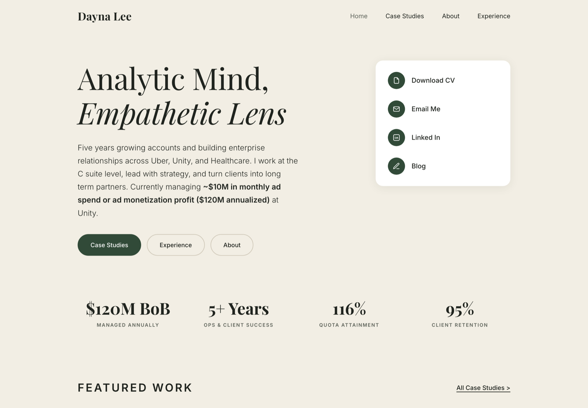

# Dayna Lee, portfolio and case studies

### Analytic Mind, Empathetic Lens

[](https://daynalee.github.io/)


My professional portfolio: five years growing enterprise accounts across Uber, Unity, and
healthcare, with four case studies written up in full.

**Live: https://daynalee.github.io/**

[](https://daynalee.github.io/)

## Case studies

| Case study | What it covers |
|---|---|
| [Unity](https://daynalee.github.io/case-study-unity.html) | Driving Multiple Ad Units adoption across a publisher book |
| [Uber Direct](https://daynalee.github.io/case-study-uber-direct.html) | Credit card debt recovery |
| [Uber Eats](https://daynalee.github.io/case-study-uber-eats.html) | Migrating merchants through the Postmates transition |
| [Pacific Pain](https://daynalee.github.io/case-study-pps.html) | Cutting patient intake time for a healthcare practice |

Also here: [About](https://daynalee.github.io/about.html) and
[Experience](https://daynalee.github.io/experience.html).

## Related projects

Two working prototypes of tooling for the roles I work in:

- [**Deal Desk**](https://github.com/daynalee/partnerships), pipeline, deal rooms, and a live
  deal economics modeler for strategic partnerships.
  [Demo](https://daynalee.github.io/partnerships/)
- [**Client Partner Copilot**](https://github.com/daynalee/client-partner), automated account
  analysis and meeting prep for ad sales.
  [Demo](https://daynalee.github.io/client-partner/)

## How it is built

Hand-built HTML and CSS. No framework, no build step, no dependencies. Fonts load from Google
Fonts. Colors, type, and spacing are controlled by the CSS variables at the top of
`css/style.css`. Deployed on GitHub Pages from `main`.

```bash
python3 -m http.server 8000
# then visit http://localhost:8000
```
